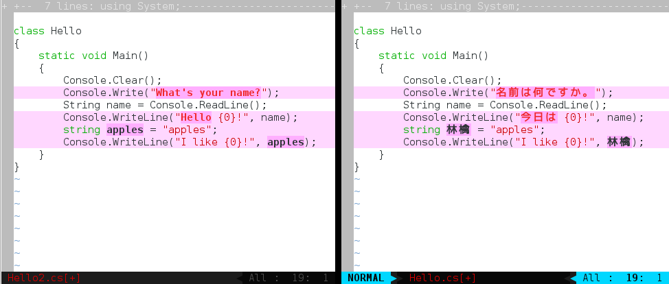

defaultPlus
===========

Slight modification of the default vim colorscheme for better readability (especially when diffing).

Installation
============

Copy defaultPlus.vim to ~/.vim/colors/ (*nix) or $HOME/vimfiles/colors/ (Windows)

Add `colorscheme defaultPlus` to your vimrc file (~/.vimrc on *nix, or $HOME/_vimrc on Windows)

Restart vim
